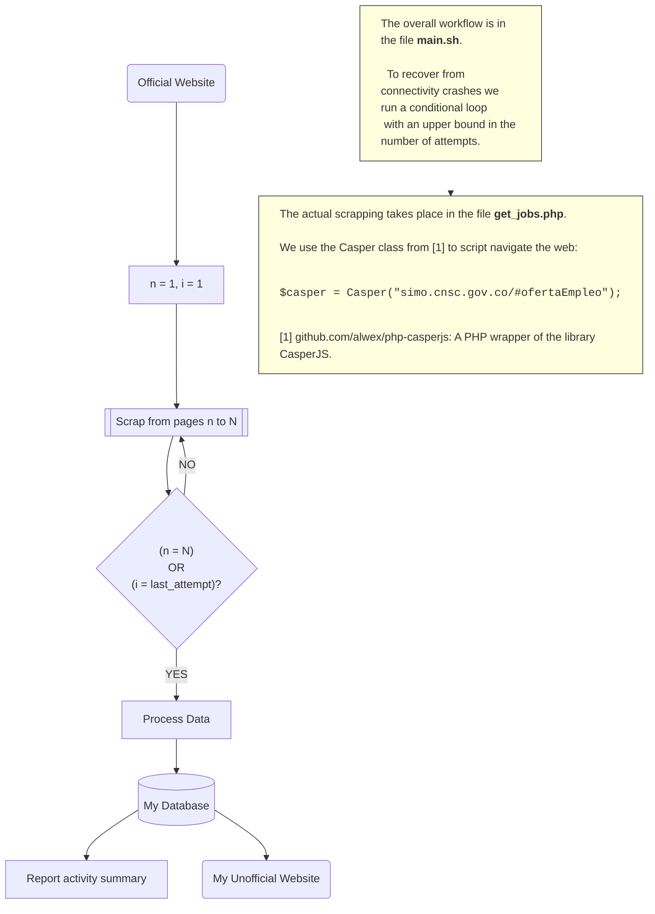

# SIMOExpress

## Esta aplicacion...
1. Extrae las ofertas de empleo reportadas en la plataforma SIMO del gobierno de Colombia.
2. Guarda las ofertas de empleo en una base de datos.
3. Ofrece un portal en linea para ofertas de empleo.

This application is comprised of three components: crawler, database and website.
[]: # 'This is a comment'
[]: # 'Data: Entity: Job offer snapshots, Attributes: page, job title, salary, etc.;'
[]: # '      Entity: Job offer, Attributes: job title, salary, etc.;...'
[]: # '      Entity: Static Data, Attributes: ..., etc.; ...'
[]: # 'Database: simo_express'
[]: # 'Database Management System (DBMS): MySQL (or MariaDB)'
[]: # 'Database Application Program: Internet database application (HTML + Apache + PHP/MySQL)'

## PHP CASPER CLASS
1.  Edit `vendor/phpcasperjs/phpcasperjs/src/Casper.php:sendKeys()` to allow setting
    of the boolean option `reset`, which is already defined in
    `vendor/jerome-breton/casperjs/modules/casper.js:sendKeys()`

    Code:

    ``{verbatim}

         /**
         *  @param string $selector
         *  @param string $input
         *  @param boolean $reset
         */

        public function sendKeys($selector, $input, $reset=false)
            {
                $jsonData = json_encode($input);

                $fragment = <<<FRAGMENT
        casper.then(function () {
                    this.sendKeys('$selector', $jsonData, { reset: $reset });
        });

        FRAGMENT;

                $this->script .= $fragment;

                return $this;
            }
    ``

2.  Define sendKeysReset() and define fetchText() in
        `vendor/phpcasperjs/phpcasperjs/src/Casper.php:sendKeys()`

    Code:

    ``{verbatim}

         /**
         *  @param string $selector
         */

        public function fetchText($selector)
            {
                $fragment = <<<FRAGMENT
        casper.then(function () {
                    this.echo(this.fetchText('$selector'));
        });

        FRAGMENT;

                $this->script .= $fragment;

                return $this;
            }
    ``

    Other interesting functions to incorporate:
    [github.com/synackSA/.../Casper.php](https://github.com/synackSA/casperjs-php/blob/master/src/Casper.php)
    Basic usage:
    [github.com/synackSA/.../README.md](https://github.com/synackSA/casperjs-php)

3.  casperjs sendKeys() uses phantomjs sendEvent(). Useful references
    ### Documentation
    [PHANTOMJS sendEvent](https://phantomjs.org/api/webpage/method/send-event.html)
    ### Code
    [https://github.com/ariya/phantomjs/blob/master/src/webpage.cpp](https://github.com/ariya/phantomjs/blob/master/src/webpage.cpp)

## Database Design
Entities: Job Offer
Attributes:

