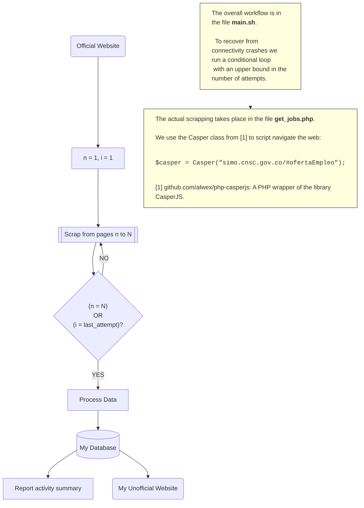

# SIMOExpress
Extrae empleos reportados por la plataforma SIMO del gobierno de Colombia.

```mermaid
flowchart TD;
source("Official Website") -->
start[n = 1, i = 1] -->
scrap[[Scrap from pages n to N]] -->
check{"(n = N) <br/> OR <br/> (i = last_attempt)?"} -- YES --> 
post[Process Data]
check -- NO --> scrap
post --> 
data[(My Database)] -->
report[Report activity summary] & myweb(My Unofficial Website) 

note["<div style='text-align:left'>The overall workflow is in the file <b>main.sh</b>.<br/><br/>  To recover from connectivity crashes we run a conditional loop<br/> with an upper bound in the number of attempts.</div>"]-->
anothernote["<div style='text-align:left'>The actual scrapping takes place in the file <b>get_jobs.php</b>.<br/><br/>We use the Casper class from [1] to script navigate the web:<br/><br/><pre>$casper = Casper(#quot;simo.cnsc.gov.co/#ofertaEmpleo#quot;);</pre><br/>[1] github.com/alwex/php-casperjs: A PHP wrapper of the library CasperJS.</div>"]
style note fill:#FFFFE0,stroke:#333;
style anothernote fill:#FFFFE0,stroke:#333;
linkStyle 8 stroke-width:0px;
%% White: #FFFFFF

```
