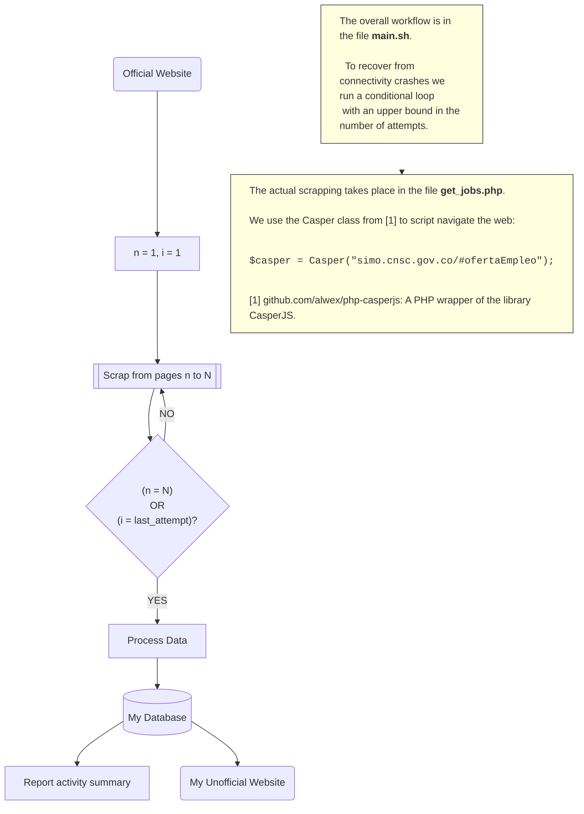

# SIMOExpress

## Esta aplicacion...
1. Extrae las ofertas de empleo reportadas en la plataforma SIMO del gobierno de Colombia.
2. Guarda las ofertas de empleo en una base de datos.
3. Ofrece un portal en linea para ofertas de empleo.

This application is comprised of three components: _crawler_, _database_ and _website_.
<!--
[comment]: # "Data: Entity: Job offer snapshots, Attributes: page, job title, salary, etc.;"
[comment]: # "      Entity: Job offer, Attributes: job title, salary, etc.;..."
[comment]: # "Database: simo_express"
[comment]: # "Database Management System (DBMS): MySQL (or MariaDB)"
[comment]: # "Database Application Program: Internet database application (HTML + Apache + PHP/MySQL)"
-->
## System Requirements
In addition to [composer](https://getcomposer.org/doc/01-basic-usage.md#introduction) and the programs in the `composer.json` file, we require

#### 1. Web Server (Ngnix, Apache, etc.)
#### 2. PHP >=8.2
jakoch/phantomjs-installer further requires installation of the bz2 (`... install php-bz2`) extension for PHP.  It is also recommended to install cURL (`... install php-curl`).
#### 3. MariaDB Server >=10.6
#### 4. PHP/MySQL support modules for the Web Server
For example, `libapache2-mod-php` to integrate PHP with Apache2 and `php-mysql` to integrate PHP with MySQL/MariaDB.
#### 5. jq - commandline JSON processor [version 1.6]
Used in `src/init/tables.sh` to convert json to array in BASH.
#### 6. Python
Required during phpcasperjs/phpcasperjs installation (`...install python-is-python3`).
#### 7. libfontconfig.so.1
Required by the `phantomjs` binary (`... install libfontconfig1`).

## PHP Casper Class
`src/utils/CasperTrio.php:CasperTrio` is a subclass of `vendor/phpcasperjs/phpcasperjs/src/Casper.php:Casper`.
It overrides and defines new methods.  To use this subclass, after downloading the vendor libraries, edit
`vendor/phpcasperjs/phpcasperjs/src/Casper.php:Casper`, replacing `private $script` with `protected $script`.<br/>
Alternatively, edit `vendor/phpcasperjs/phpcasperjs/src/Casper.php:sendKeys()` to allow setting
of the boolean option `reset`, which is already defined in
`vendor/jerome-breton/casperjs/modules/casper.js:sendKeys()`

    Code:

    ```php
        /**
         *  @param string $selector
         *  @param string $input
         *  @param boolean $reset
         */
        public function sendKeys($selector, $input, $reset=false)
            {
                $jsonData = json_encode($input);

                $fragment = <<<FRAGMENT
        casper.then(function () {
                    this.sendKeys('$selector', $jsonData, { reset: $reset });
        });

        FRAGMENT;

                $this->script .= $fragment;

                return $this;
            }
    ```

    And define `vendor/phpcasperjs/phpcasperjs/src/Casper.php:fetchText()`

    Code:

    ```php
        /**
         *  @param string $selector
         */
        public function fetchText($selector)
            {
                $fragment = <<<FRAGMENT
        casper.then(function () {
                    this.echo(this.fetchText('$selector'));
        });

        FRAGMENT;

                $this->script .= $fragment;

                return $this;
            }
    ```

#### Notes

1.  There are other useful functions in PHP/CasperJS. See the links below.<br/>
    Code:<br/>
    [https://github.com/synackSA/casperjs-php/blob/master/src/Casper.php](https://github.com/synackSA/casperjs-php/blob/master/src/Casper.php)<br/>
    Basic usage:<br/>
    [https://github.com/synackSA/casperjs-php](https://github.com/synackSA/casperjs-php)

2.  casperjs' `sendKeys()` uses phantomjs' `sendEvent()`. Useful references about the latter:<br/>
    Documentation:
    [PHANTOMJS sendEvent](https://phantomjs.org/api/webpage/method/send-event.html)<br/>
    Code:<br/>
    [https://github.com/ariya/phantomjs/blob/master/src/webpage.cpp](https://github.com/ariya/phantomjs/blob/master/src/webpage.cpp)

3.  Another important section of code is `vendor/jerome-breton/casperjs/modules/clientutils.js:setField`,
    used in casperjs' `sendKeys()` method.

## Setup
1. Execute `composer install` to build dependencies specified in `composer.lock`.
2. Modify `src/config.sh` according to your custom values.

## Troubleshooting

1. Lower versions of some packages can conflict with higher versions of Composer.
Composer should install the most recent version of any package, under the given constratints. Sometimes one is required to remove the vendor folder and run again `composer install`.
If for some reason you are stuck with a lower version of a package (e.g. `jakoch/phantomjs-installer`) and it conflicts with the Composer version 2, you may have to modify the `Installer` class `download()` method in the corresponding `Installer.php` file, to handle different versions of Composer.
This is a generic method, so you can use any other, more recent, package as a reference (e.g. `jerome-breton/casperjs-installer`) or replace the installer file with one more recent in the source repository (e.g. `jakoch/phantomjs-installer` at Github).
To run the customized installers execute `composer update` in the same directory of your `composer.json`.
You may have to run the installer several times, until you find the `phpcasperjs` and `phantomjs` binaries in the newly created `vendor/bin/` directory.

## Database Design
Entities: Job Offer
Attributes:


